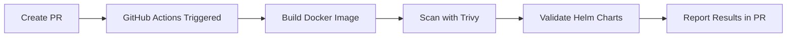

# CI/CD Process for n8n Custom Images

## Overview

This document describes the automated CI/CD process for building and deploying custom n8n Docker images to Docker Hub and updating Kubernetes deployments via Argo CD.

## Repository Structure

- **Docker Image Repository**: `nomad1111/n8n-custom` on Docker Hub
- **Git Branches**: `develop`, `uat`, `main`
- **Image Tags**: `develop`, `uat`, `main` (matching branch names)

## Automated Workflow

### GitHub Actions Workflow

The `.github/workflows/ci-cd.yaml` workflow supports **PR-based promotion** with validation and deployment:

#### On Pull Requests (Validation Only):
1. **Triggers** on pull requests targeting `develop`, `uat`, or `main` branches
2. **Builds** Docker image from `docker/Dockerfile` (validation only, not pushed)
3. **Scans** image with Trivy for security vulnerabilities
4. **Validates** Helm charts (lint + template rendering)
5. **Reports** results in PR checks
6. **Does NOT** push images or update Helm values

#### On Push (After PR Merge - Full Deployment):
1. **Triggers** on push to `develop`, `uat`, or `main` branches (after PR merge)
2. **Builds** Docker image from `docker/Dockerfile`
3. **Scans** image with Trivy for security vulnerabilities
4. **Validates** Helm charts (lint + template rendering)
5. **Tags** image as `nomad1111/n8n-custom:<branch-name>`
6. **Pushes** image to Docker Hub
7. **Updates** Helm values file with new image tag
8. **Commits** changes back to repository
9. **Argo CD** detects changes and auto-syncs deployment

### Workflow Steps

#### Pull Request Flow (Validation):


#### Push Flow (Deployment):

```mermaid
graph LR
    A[Merge PR] --> B[Push to Branch]
    B --> C[GitHub Actions Triggered]
    C --> D[Build Docker Image]
    D --> E[Scan with Trivy]
    E --> F[Validate Helm Charts]
    F --> G[Tag Image]
    G --> H[Push to Docker Hub]
    H --> I[Update Helm Values]
    I --> J[Commit to Git]
    J --> K[Argo CD Auto-Sync]
    K --> L[Kubernetes Deployment]
```


### Branch Promotion Workflow

**Development → UAT → Production:**

1. **Work on `develop` branch:**
   - Create feature branch from `develop`
   - Make changes and commit
   - Open PR targeting `develop` branch
   - CI validates (builds, scans, validates Helm charts)
   - Merge PR to `develop` → triggers deployment to dev environment

2. **Promote to UAT:**
   - Open PR from `develop` to `uat` branch
   - CI validates PR (builds, scans, validates)
   - Merge PR to `uat` → triggers deployment to UAT environment

3. **Promote to Production:**
   - Open PR from `uat` to `main` branch
   - CI validates PR (builds, scans, validates)
   - Merge PR to `main` → triggers deployment to production environment

**Key Benefits:**
- ✅ Code validation before merge
- ✅ Security scanning on every PR
- ✅ Helm chart validation prevents deployment errors
- ✅ Controlled promotion through PRs
- ✅ Can continue working on `develop` while UAT/prod are running

## Setup Requirements

### 1. Docker Hub Secrets

Add the following secrets to your GitHub repository:

- `DOCKER_USERNAME`: Your Docker Hub username (`nomad1111`)
- `DOCKER_PASSWORD`: Your Docker Hub access token or password

**To add secrets:**
1. Go to GitHub repository → Settings → Secrets and variables → Actions
2. Click "New repository secret"
3. Add `DOCKER_USERNAME` and `DOCKER_PASSWORD`

### 2. GitHub Token Permissions

The workflow requires write permissions to commit back to the repository. This is automatically granted via `GITHUB_TOKEN` with `contents: write` permission.

## Manual Process (If Needed)

If you need to build and push images manually:

### Build and Push Custom Image

```bash
# For develop branch
docker build -t nomad1111/n8n-custom:develop -f docker/Dockerfile ./docker
docker push nomad1111/n8n-custom:develop

# For uat branch
docker build -t nomad1111/n8n-custom:uat -f docker/Dockerfile ./docker
docker push nomad1111/n8n-custom:uat

# For main branch
docker build -t nomad1111/n8n-custom:main -f docker/Dockerfile ./docker
docker push nomad1111/n8n-custom:main
```

### Update Helm Values Manually

After pushing images, update the values files:

**For UAT** (`helm/values-uat.yaml`):
```yaml
image:
  repository: nomad1111/n8n-custom
  tag: uat
  pullPolicy: Always
```

**For Prod** (`helm/values-prod.yaml`):
```yaml
image:
  repository: nomad1111/n8n-custom
  tag: main
  pullPolicy: Always
```

Then commit and push to the respective branches:
```bash
git add helm/values-uat.yaml helm/values-prod.yaml
git commit -m "chore: switch to custom images"
git push origin uat  # or main for prod
```

## Current Status

### Temporary Configuration

All environments are now configured to use the custom Docker image (`nomad1111/n8n-custom`) with branch-based tags. The values files are automatically updated by the workflow when images are built and pushed.

### Image Configuration

All environments are pre-configured to use custom images:
- **Dev**: `nomad1111/n8n-custom:develop`
- **UAT**: `nomad1111/n8n-custom:uat`
- **Prod**: `nomad1111/n8n-custom:main`

The workflow automatically:
1. **On PRs**: Validates code (builds image, scans, validates Helm charts) - no deployment
2. **On Push (after merge)**: Builds image, pushes to Docker Hub, updates Helm values, commits changes
3. Argo CD auto-syncs deployment when Helm values are updated

**PR Validation Features:**
- Docker image build validation
- Trivy security scanning
- Helm chart linting
- Helm template validation (all three environments)
- Results reported in PR checks

No manual intervention required once Docker Hub secrets are configured. All changes flow through PRs for validation before deployment.

## Image Build Process

### Dockerfile Location

The Docker image is built from: `docker/Dockerfile`

### Base Image

Currently uses: `n8nio/n8n:latest` as base image

### Customization

To customize the image, modify `docker/Dockerfile`:

```dockerfile
FROM n8nio/n8n:latest

# Add custom packages
RUN apk add --no-cache <package-name>

# Copy custom files
COPY custom-scripts/ /custom/

# Set environment variables
ENV CUSTOM_VAR=value

WORKDIR /data
```

## Branch Strategy

| Branch | Image Tag | Helm Values | Argo CD App | Namespace |
|--------|-----------|-------------|-------------|-----------|
| `develop` | `develop` | `values-dev.yaml` | `n8n-dev` | `n8n-dev` |
| `uat` | `uat` | `values-uat.yaml` | `n8n-uat` | `n8n-uat` |
| `main` | `main` | `values-prod.yaml` | `n8n-prod` | `n8n-prod` |

## Verification

### Check Image Exists

```bash
# Check if image exists on Docker Hub
docker pull nomad1111/n8n-custom:develop
docker pull nomad1111/n8n-custom:uat
docker pull nomad1111/n8n-custom:main
```

### Check Argo CD Sync Status

```bash
kubectl get applications -n argocd | grep n8n
```

### Check Pod Images

```bash
# Check what image pods are using
kubectl get deployment -n n8n-uat n8n-api -o jsonpath='{.spec.template.spec.containers[0].image}'
kubectl get deployment -n n8n-prod n8n-api -o jsonpath='{.spec.template.spec.containers[0].image}'
```

## Troubleshooting

### Image Pull Errors

If pods show `ImagePullBackOff`:

1. **Verify image exists**: `docker pull nomad1111/n8n-custom:<tag>`
2. **Check Docker Hub**: Ensure image is public or credentials are correct
3. **Verify imagePullSecrets**: If using private repo, ensure secrets are configured
4. **Check image tag**: Ensure tag matches branch name

### Workflow Failures

If GitHub Actions workflow fails:

1. **Check secrets**: Verify `DOCKER_USERNAME` and `DOCKER_PASSWORD` are set
2. **Check Docker Hub**: Ensure account has push permissions
3. **Check workflow logs**: Review GitHub Actions logs for errors
4. **Verify Dockerfile**: Ensure `docker/Dockerfile` exists and is valid

### Argo CD Not Syncing

If Argo CD doesn't sync after image push:

1. **Check Argo CD status**: `kubectl get applications -n argocd`
2. **Force sync**: Use Argo CD UI or CLI to manually sync
3. **Check branch**: Ensure changes are on correct branch (`uat` or `main`)
4. **Verify values file**: Check that image repository and tag are correct

## Security Scanning

The CI/CD pipeline includes automated security scanning:

- **Trivy**: Scans Docker images for vulnerabilities
  - Runs on **both PRs and pushes**
  - Integrated into `.github/workflows/ci-cd.yaml`
  - Scans built images (before pushing on push events)
  - Results uploaded to GitHub Security tab
  - Reports findings in PR checks
  
- **CodeQL**: Analyzes code for security issues
  - Runs on **pull requests** only
  - Separate workflow: `.github/workflows/codeql-analysis.yml`
  - Scans JavaScript/TypeScript, YAML configs, Helm charts
  - Results uploaded to GitHub Security tab
  - Reports findings in PR checks

- **Helm Validation**: Validates Helm charts
  - Runs on **both PRs and pushes**
  - Validates chart syntax with `helm lint`
  - Validates template rendering with `helm template`
  - Validates all three environment values files
  - Reports errors in workflow logs and PR checks

All tools are configured as **non-blocking** - they report findings but don't prevent deployments. However, Helm validation errors will fail the workflow to prevent invalid deployments.

**See `SECURITY_SCANNING.md` for detailed information on security scanning.**

## Next Steps

1. **Set up Docker Hub secrets** in GitHub repository
2. **Test PR workflow** by creating a PR to `develop` branch
   - Verify validation runs (build, scan, validate Helm charts)
   - Check PR checks show validation results
3. **Merge PR** to trigger deployment
   - Verify image is pushed to Docker Hub
   - Check Argo CD syncs automatically
4. **Test branch promotion**:
   - Create PR from `develop` to `uat` → validate
   - Merge to `uat` → verify UAT deployment
   - Create PR from `uat` to `main` → validate
   - Merge to `main` → verify production deployment
5. **Review security scan results** in GitHub Security tab and PR checks

## References

- **Docker Hub Repository**: https://hub.docker.com/repository/docker/nomad1111/n8n-custom
- **GitHub Actions**: `.github/workflows/ci-cd.yaml`
- **CodeQL Workflow**: `.github/workflows/codeql-analysis.yml`
- **Dockerfile**: `docker/Dockerfile`
- **Helm Values**: `helm/values-*.yaml`
- **Security Scanning**: `SECURITY_SCANNING.md`
- **Setup Guide**: `SETUP_GUIDE.md`

---

*Last Updated: November 2025*

