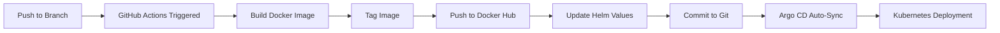

# CI/CD Process for n8n Custom Images

## Overview

This document describes the automated CI/CD process for building and deploying custom n8n Docker images to Docker Hub and updating Kubernetes deployments via Argo CD.

## Repository Structure

- **Docker Image Repository**: `nomad1111/n8n-custom` on Docker Hub
- **Git Branches**: `develop`, `uat`, `main`
- **Image Tags**: `develop`, `uat`, `main` (matching branch names)

## Automated Workflow

### GitHub Actions Workflow

The `.github/workflows/ci-cd.yaml` workflow automatically:

1. **Triggers** on push to `develop`, `uat`, or `main` branches
2. **Builds** Docker image from `docker/Dockerfile`
3. **Tags** image as `nomad1111/n8n-custom:<branch-name>`
4. **Pushes** image to Docker Hub
5. **Updates** Helm values file with new image tag
6. **Commits** changes back to repository
7. **Argo CD** detects changes and auto-syncs deployment

### Workflow Steps



## Setup Requirements

### 1. Docker Hub Secrets

Add the following secrets to your GitHub repository:

- `DOCKER_USERNAME`: Your Docker Hub username (`nomad1111`)
- `DOCKER_PASSWORD`: Your Docker Hub access token or password

**To add secrets:**
1. Go to GitHub repository → Settings → Secrets and variables → Actions
2. Click "New repository secret"
3. Add `DOCKER_USERNAME` and `DOCKER_PASSWORD`

### 2. GitHub Token Permissions

The workflow requires write permissions to commit back to the repository. This is automatically granted via `GITHUB_TOKEN` with `contents: write` permission.

## Manual Process (If Needed)

If you need to build and push images manually:

### Build and Push Custom Image

```bash
# For develop branch
docker build -t nomad1111/n8n-custom:develop -f docker/Dockerfile ./docker
docker push nomad1111/n8n-custom:develop

# For uat branch
docker build -t nomad1111/n8n-custom:uat -f docker/Dockerfile ./docker
docker push nomad1111/n8n-custom:uat

# For main branch
docker build -t nomad1111/n8n-custom:main -f docker/Dockerfile ./docker
docker push nomad1111/n8n-custom:main
```

### Update Helm Values Manually

After pushing images, update the values files:

**For UAT** (`helm/values-uat.yaml`):
```yaml
image:
  repository: nomad1111/n8n-custom
  tag: uat
  pullPolicy: Always
```

**For Prod** (`helm/values-prod.yaml`):
```yaml
image:
  repository: nomad1111/n8n-custom
  tag: main
  pullPolicy: Always
```

Then commit and push to the respective branches:
```bash
git add helm/values-uat.yaml helm/values-prod.yaml
git commit -m "chore: switch to custom images"
git push origin uat  # or main for prod
```

## Current Status

### Temporary Configuration

Currently, UAT and prod are using the official `n8nio/n8n:latest` image temporarily. The values files have TODO comments indicating where to switch back.

### Switching to Custom Images

Once images are built and pushed:

1. **Automatic** (via GitHub Actions):
   - Push to `uat` or `main` branch
   - Workflow builds and pushes image
   - Values file automatically updated
   - Argo CD syncs deployment

2. **Manual**:
   - Build and push images (see above)
   - Update values files
   - Commit and push to branches
   - Argo CD will auto-sync

## Image Build Process

### Dockerfile Location

The Docker image is built from: `docker/Dockerfile`

### Base Image

Currently uses: `n8nio/n8n:latest` as base image

### Customization

To customize the image, modify `docker/Dockerfile`:

```dockerfile
FROM n8nio/n8n:latest

# Add custom packages
RUN apk add --no-cache <package-name>

# Copy custom files
COPY custom-scripts/ /custom/

# Set environment variables
ENV CUSTOM_VAR=value

WORKDIR /data
```

## Branch Strategy

| Branch | Image Tag | Helm Values | Argo CD App | Namespace |
|--------|-----------|-------------|-------------|-----------|
| `develop` | `develop` | `values-dev.yaml` | `n8n-dev` | `n8n-dev` |
| `uat` | `uat` | `values-uat.yaml` | `n8n-uat` | `n8n-uat` |
| `main` | `main` | `values-prod.yaml` | `n8n-prod` | `n8n-prod` |

## Verification

### Check Image Exists

```bash
# Check if image exists on Docker Hub
docker pull nomad1111/n8n-custom:develop
docker pull nomad1111/n8n-custom:uat
docker pull nomad1111/n8n-custom:main
```

### Check Argo CD Sync Status

```bash
kubectl get applications -n argocd | grep n8n
```

### Check Pod Images

```bash
# Check what image pods are using
kubectl get deployment -n n8n-uat n8n-api -o jsonpath='{.spec.template.spec.containers[0].image}'
kubectl get deployment -n n8n-prod n8n-api -o jsonpath='{.spec.template.spec.containers[0].image}'
```

## Troubleshooting

### Image Pull Errors

If pods show `ImagePullBackOff`:

1. **Verify image exists**: `docker pull nomad1111/n8n-custom:<tag>`
2. **Check Docker Hub**: Ensure image is public or credentials are correct
3. **Verify imagePullSecrets**: If using private repo, ensure secrets are configured
4. **Check image tag**: Ensure tag matches branch name

### Workflow Failures

If GitHub Actions workflow fails:

1. **Check secrets**: Verify `DOCKER_USERNAME` and `DOCKER_PASSWORD` are set
2. **Check Docker Hub**: Ensure account has push permissions
3. **Check workflow logs**: Review GitHub Actions logs for errors
4. **Verify Dockerfile**: Ensure `docker/Dockerfile` exists and is valid

### Argo CD Not Syncing

If Argo CD doesn't sync after image push:

1. **Check Argo CD status**: `kubectl get applications -n argocd`
2. **Force sync**: Use Argo CD UI or CLI to manually sync
3. **Check branch**: Ensure changes are on correct branch (`uat` or `main`)
4. **Verify values file**: Check that image repository and tag are correct

## Next Steps

1. **Set up Docker Hub secrets** in GitHub repository
2. **Test workflow** by pushing to `develop` branch
3. **Verify image** is pushed to Docker Hub
4. **Check Argo CD** syncs automatically
5. **Switch UAT/prod** from official image to custom images

## References

- **Docker Hub Repository**: https://hub.docker.com/repository/docker/nomad1111/n8n-custom
- **GitHub Actions**: `.github/workflows/ci-cd.yaml`
- **Dockerfile**: `docker/Dockerfile`
- **Helm Values**: `helm/values-*.yaml`

---

*Last Updated: November 2025*

